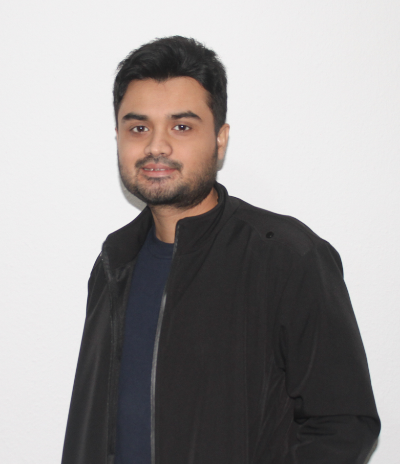

  <!-- Left Column -->
  

    
  

  <!-- Right Column (main content) -->
  

    <!-- Your existing content goes here -->
    <h1>Jubair Khandaker</h1>
    
Recent Master's graduate in Technology and Innovation Management...

    <!-- etc. -->
  

### Profile

Recent Master’s graduate in Technology and Innovation Management with experience in business intelligence and data analysis. Proficient in MS Excel, Power Automate, Power BI, and SQL as well as have expertise in process optimization, technical reporting, and digital transformation in cross-functional environments.

### Core Competencies
 - Digital process optimization
 - Business intelligence tools
 - Technical documentation
 - Cross functional team collaboration
 - Data driven decision making

### Work Experiences

#### Master’s Thesis & Working Student - Production Data Analysis                                                              
_April 2024 - December 2024_                                                                                           
- Contributed to the full development cycle of predictive maintenance solutions, helping reduce machine downtime upto 75% and improve customer satisfaction
- Developed efficient processes that improved data quality significantly (upto 100%) and made analysis faster and more efficient
- Delivered data-driven insights to support maintenance decisions in cross-functional environment
- Defined and executed project goals for predictive maintenance initiatives, aligned with operational needs

#### Working Student - Product and Project Management                                                                                                    
_January 2023 - December 2023_   
- Led product management for a development project to sell software features for SIG filling machines, evaluating technical, commercial, and operational feasibility, and aligning with business stakeholders
- Tracked progress, monitored deadlines, scheduled meetings, conducted budget analysis, defined feature requirements, developed milestones plans, developed workflow and diagrams for projects
- Led a project to evaluate machine effectiveness by analyzing server data using PostgreSQL
- Assessed customer requirements by analyzing survey insights (over 150 individual surveys) to identify pain points and gain factors
- Developed marketing materials like newsletters and short videos to support promotion of products

#### Industrial Engineer - Supply Chain and Product Management
_January 2020 - June 2020_   
- Followed up on pre-production activities to ensure in-time supply of inventory and the flow of production according to the proposed plan
- Coordinated the tasks with internal stakeholders such as the merchandising team, planning team, sales team, and warehouse to avoid backlog and feeding crisis
- Performed time study and capacity study to monitor the performances of the production units
- Performed porocess optimization using lean tools such as KANBAN and SMED. Reduced idle time by 5 to 10 minutes per production cycle
- Brainstorming the probable solutions to issues that cause loss of time in production units by holding meetings with the managerial team
- Reduced the defect rates (upto 40%) by following the DMAIC approach of six sigma under the supervision of the higher management
- Creating daily and monthly reports to track the efficiency of production units

### Education
#### Masters of Engineering in Technology and Innovation Management
_March 2021 - February 2025_ 
- University : Hochschule Harz; Wernigerode, Germany
- Grade : 1.80
- Thesis : Optimizing Preventive Maintenance Strategies in Food and Beverage Packaging: Machine Learning Approaches for Predicting Structural Component Failures in Aseptic Filling Machines
- Noteworthy Coursework : Agile Requirements Engineering and Digital Business Transformation, Digital Business Model, Strategic Innovation Management, and Engineering Project, Technology Assessment and Sustainability

#### Bachelors of Science in Industrial and Production Engineering
_April 2014 - February 2019_ 
- University : Shahjalal University of Science and Technology; Sylhet, Bangladesh
- Grade : 2.00
- Thesis : Adoption of Lean Tools and Techniques in Garments Manufacturing Industries in Bangladesh
- Relevant Coursework : Project Management, Supply Chain Management, Operation Management, Product Design and Development, Operations Research, Quality Control and Management

### Technical Skills
- Data & Database Tools : SQL (MySQL, PostgreSQL)
- Business Intelligence Tools : BI tools (MS Power BI)
- Programming Language : Python
- Productivity and Office Tools : MS Office (Excel, PowerPoint, Word, Outlook, SharePoint, Visio, Power Automate), Google Sheets, Jira, and SAP S4/ Hana (basic)
